# Slide Aid Documentation

Slide Aid is a PowerPoint productivity add-in for Mac. It focuses on repeatable slide-production tasks: aligning objects, matching sizes, managing colors and text, reusing components, and building editable shape-based charts from PowerPoint tables.

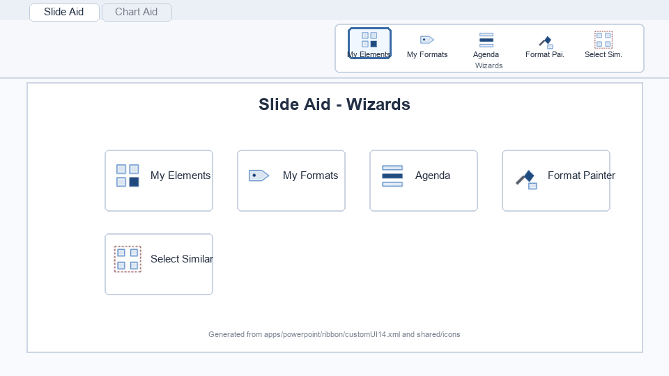

## Core model

- **Master means last selected.** Select the objects you want to change first, then select the reference object last. Slide Aid calls that last object the Master.
- **One selected object uses the slide as reference.** Alignment, docking, stretching, and some placement tools fall back to the slide when there is no separate Master object.
- **Distances are centimeters.** Spacing, gaps, margins, and similar prompts use cm; Slide Aid converts internally to PowerPoint points.
- **Objects stay editable.** The tools operate on normal PowerPoint shapes, tables, and text boxes. Chart Aid charts are also built from ordinary shapes and carry metadata for rebuilding.

## Common workflows

### Align and size objects

1. Select the objects to change.
2. Select the reference object last. This is the Master.
3. Use **Left**, **Right**, **Top**, **Bottom**, **Center**, **Middle**, **Width**, **Height**, or **Width + Height**.

Use **To Slide** when the slide itself should be the reference. Use **Dock**, **Stretch**, and **Fill Gap** when objects should touch or extend toward the Master instead of merely aligning to it.

### Clean up a layout

Use **Distribute H/V** for equal gaps between existing objects, **Spacing** for an exact gap in cm, **Stack** for touching objects in selection order, and **Matrix** for a quick grid. **Swap** is useful when two objects have the right formatting but need to trade places.

### Reuse slide components

Use **My Elements** to store reusable shape groups and **My Formats** to save the full formatting of a Master object. These are stored in PowerPoint's sandbox-safe Slide Aid folder, so they work without repeated file permission prompts.

### Build editable charts

1. Create a PowerPoint table in one of the layouts described in [Chart layouts](docs/CHARTS.md).
2. Select the table.
3. Choose a chart type on the **Chart Aid** tab.
4. Use **Edit Data** to recreate the data table later, edit values, then select table + chart and click **Rebuild**.

Use **Sample Slides** to insert live examples for every chart type. Copy those tables as starting points when you are unsure about a layout.

### Polish before sending

Use **Pick from Master**, **Convert to Theme**, and the color menus to keep colors template-aware. Use **Fit to Text**, **Set Margins**, **Wrap Text**, and **More** for common text-box fixes. Use **Clean-up** to remove notes, animations, unused designs, generated agenda slides, or chart sample slides before sharing a deck.

## Icon Reference

The tables below list the top-level controls that appear on the Slide Aid and Chart Aid ribbon tabs. Menu controls list their main menu entries in the description.

### Slide Aid Tab

#### Wizards

| Icon | Tool | What it does |
|---|---|---|
|  | **My Elements** | Insert one of your reusable elements. Your personal element library. 'Add Selection to My Elements' stores any shapes for reuse; clicking an entry inserts it on the current slide. |
|  | **My Formats** | Apply one of your saved formats. Save the Master's complete format once ('Save Master's Format'), then reapply it to any selection with one click. |
|  | **Agenda** | Generate agenda slides from your sections. Creates an overview slide plus a separator before each PowerPoint section, with the current item highlighted. Re-run after changing sections - generated slides are replaced automatically. |
|  | **Format Painter** | Copy the Master's complete format to the other objects. The Master is always the object you selected last. Fill, line, shadow, font, margins and alignment are copied - the whole look. |
|  | **Select Similar** | Select all similar shapes on this slide. Similar to the Master by shape type, fill color, or both - then apply any tool to all of them at once. Menu entries: Same Shape Type, Same Fill Color, Same Type + Fill. |

#### Position

| Icon | Tool | What it does |
|---|---|---|
|  | **Left** | Align left edges to the Master. The Master is always the object you selected last. With a single object selected, the slide is the reference instead. |
|  | **Right** | Align right edges to the Master. The Master is always the object you selected last. With a single object selected, the slide is the reference instead. |
|  | **Top** | Align top edges to the Master. The Master is always the object you selected last. With a single object selected, the slide is the reference instead. |
|  | **Bottom** | Align bottom edges to the Master. The Master is always the object you selected last. With a single object selected, the slide is the reference instead. |
| 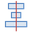 | **Center** | Center the objects horizontally on the Master. The Master is always the object you selected last. With a single object selected, the slide is the reference instead. |
|  | **Middle** | Center the objects vertically on the Master. The Master is always the object you selected last. With a single object selected, the slide is the reference instead. |
|  | **To Slide** | Align to the slide instead of the Master. Use this when several objects are selected but the slide should be the reference. Menu entries: Left, Right, Top, Bottom, Center, Middle. |
| 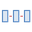 | **Distribute H** | Distribute horizontally with even gaps. The outermost objects keep their positions; the spaces between all objects in between are made equal. |
| 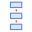 | **Distribute V** | Distribute vertically with even gaps. The outermost objects keep their positions; the spaces between all objects in between are made equal. |
|  | **Swap** | Swap the objects' positions. Follows selection order: each object takes the next one's place (two objects simply switch). Pick the reference corner for differently sized objects. The layer position is swapped too, as that is correct in most cases. Menu entries: At Centers, At Top-Left, At Top-Right, At Bottom-Left, At Bottom-Right, Incl. Sizes, Without Layer Swap. |
|  | **Dock** | Move the objects until they touch the Master. The Master is always the object you selected last. Example: Dock Left moves objects left until they hit the Master's right edge. With a single object selected, the slide is the reference instead. Menu entries: Dock Left, Dock Right, Dock Up, Dock Down. |
|  | **Stack** | Stack the objects so they touch, in selection order. Click the objects in the order you want them stacked; the first one keeps its position. Use '+ Gap' for a fixed spacing - negative values overlap. Menu entries: Horizontally, Vertically, Horizontally + Gap…, Vertically + Gap…. |
|  | **Matrix** | Arrange the objects in a grid - one click. Near-square grid, objects touching, filled row by row in selection order. Use 'Matrix...' to choose columns and gaps. |
| 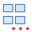 | **Matrix…** | Arrange in a grid with custom columns and gaps. You choose the number of columns and the horizontal/vertical gaps (cm). |
|  | **Place on Slide** | Move the selection into a slide region. A single object is resized to fill the region (small margin); several objects are moved as a block to the region's top-left corner, keeping their sizes and spacing. Menu entries: Left Half, Right Half, Top Half, Bottom Half, Left Third, Center Third, Right Third, Top-Left Quadrant, Top-Right Quadrant, Bottom-Left Quadrant, Bottom-Right Quadrant, Full Slide. |
|  | **Spacing** | Set an exact distance between the objects. Enter the spacing in cm; negative values make objects overlap. Objects are spaced in their current position order. Menu entries: Horizontal…, Vertical…. |
|  | **Golden Canon** | Place objects at the golden-canon height inside the Master. The bottom margin becomes twice the top margin - the vertical position most pleasing to the eye. The Master (last selected) should be taller than the objects. |

#### Size

| Icon | Tool | What it does |
|---|---|---|
| 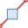 | **Magic Resizer** | Resize the selection by a percentage. Scales width, height and font sizes of all selected objects around their centers - shrink or enlarge whole arrangements without breaking proportions. |
|  | **Width** | Give all objects the Master's width. The Master is always the object you selected last. Objects keep their centers. |
|  | **Height** | Give all objects the Master's height. The Master is always the object you selected last. Objects keep their centers. |
|  | **Width + Height** | Give all objects the Master's size. The Master is always the object you selected last. Objects keep their centers. |
|  | **Stretch** | Stretch the objects to the far edge of the Master. The Master is always the object you selected last. Example: Stretch Right extends each object's right edge to the Master's right edge; the opposite edge stays fixed. With a single object selected, the slide is the reference instead. Menu entries: Left, Right, Top, Bottom. |
|  | **Fill Gap** | Fill the gap between the objects and the Master. The Master is always the object you selected last. Each object is extended toward the Master until they touch. Example: Fill Rightwards extends right edges to the Master's left edge. Menu entries: Leftwards, Rightwards, Upwards, Downwards. |
|  | **Slice** | Slice the shape into equal pieces. Cuts the selected shape into a rows-by-columns grid with a gap you choose; the pieces exactly reassemble the original footprint. |
|  | **Multiply** | Duplicate the shape into a grid. Creates a rows-by-columns grid of copies at the original size, with a gap you choose. |

#### Shape

| Icon | Tool | What it does |
|---|---|---|
|  | **Process Chain** | Align block arrows into a process chain. The Master is always the object you selected last. It defines the angle, vertical position and height for all arrows; gaps are closed from left to right. |
|  | **Align Angles** | Copy the Master's rotation to all objects. The Master is always the object you selected last. Adjustment handles (e.g. arrowhead proportions) are copied too when the shapes are of the same type. |
|  | **Block Arrows** | Apply the Master's arrow metrics to all block arrows. Arrowhead size and shaft thickness are copied so mixed arrows look uniform. The Master is always the object you selected last. |
|  | **Rounded Rect.** | Give all rounded rectangles the same corner radius. PowerPoint stores the radius relative to shape size, so equal-looking corners need different settings per shape - this applies one absolute radius (default: the Master's) to all. |
| 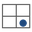 | **Snap to Table** | Snap objects to the table cell beneath them. Aligns icons, Harvey balls or flags to the cell they roughly sit over - centered, or left/right-aligned with a margin you choose. Menu entries: Center in Cell, Left in Cell…, Right in Cell…. |

#### Color

| Icon | Tool | What it does |
|---|---|---|
|  | **Fill** | Set the fill color. Theme colors stay linked to the template and adapt when the design changes; palette colors are fixed RGB. Swatches preview the standard Office theme - the applied color follows your actual template. Menu entries: Accent 1, Accent 2, Accent 3, Accent 4, Accent 5, Accent 6, Text/Dark 1, Background/Light 1, Text/Dark 2, Background/Light 2, Dark blue, Blue, Green, Red, Orange, Purple, Dark grey, Light grey. |
|  | **Line** | Set the line color. Theme colors stay linked to the template; palette colors are fixed RGB. Menu entries: Accent 1, Accent 2, Accent 3, Accent 4, Accent 5, Accent 6, Text/Dark 1, Text/Dark 2, Dark blue, Red, Dark grey. |
|  | **Font** | Set the font color. Theme colors stay linked to the template; palette colors are fixed RGB. Menu entries: Accent 1, Accent 2, Accent 3, Accent 4, Accent 5, Accent 6, Text/Dark 1, Background/Light 1, Dark blue, Red, Dark grey. |
|  | **Pick from Master** | Copy the Master's colors to the other objects. The Master is always the object you selected last. Copy fill, line and font color together or individually; theme links are preserved. Menu entries: Fill + Line + Font, Fill only, Line only, Font only. |
|  | **Convert to RGB** | Convert theme colors to fixed RGB. Makes the colors independent of the slide master and theme - they stay identical when the slides move to another template. |
|  | **Convert to Theme** | Convert matching RGB colors to theme colors. Colors that match the current theme become theme-linked and adapt automatically to the slide master and theme used. |
|  | **Color Info** | Show the selected object's fill color. Displays RGB and hex values and whether the color is theme-linked. |

#### Text

| Icon | Tool | What it does |
|---|---|---|
|  | **Set Margins** | Set all four text margins at once. One value (cm) is applied to the left, right, top and bottom internal margins of every selected text box. |
| 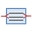 | **Fit to Text** | Fit the shape to its text. Shrinks or grows each selected shape to the size of the contained text. |
|  | **Wrap Text** | Toggle text wrapping. Switches word wrap on or off in the selected shapes. |
|  | **Split at Cursor** | Split the text box at the cursor. Click into the text where the split should happen, then run - you get two text boxes with formatting preserved. |
|  | **Merge Boxes** | Merge the text boxes into one. In selection order; each box becomes a paragraph of the first one. Formatting is kept where possible. |
| 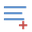 | **More** | Case, tidy-up and swap tools. Change case keeps per-run formatting. Swap Text exchanges the plain text of exactly two objects (each adopts its box's formatting). Menu entries: UPPERCASE, lowercase, Title Case, Sentence case, Remove Double Spaces, Swap Text (2 objects). |

#### View & Expert

| Icon | Tool | What it does |
|---|---|---|
|  | **Hide Objects** | Hide the selected objects temporarily. Objects keep their position and layer while hidden - useful on crowded slides. Bring everything back with Unhide All. |
|  | **Unhide All** | Unhide all hidden objects on this slide. |
| 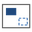 | **Master Objects** | Show or hide the slide master's background objects. |
|  | **Clean-up** | Clean up the presentation before sending. Remove all speaker notes or animations, delete unused designs to shrink the file, or copy a slide-title summary to the clipboard. Menu entries: Remove All Speaker Notes, Remove All Animations, Delete Unused Designs, Copy Slide Summary to Clipboard, Selected Slides to New Presentation, Remove Generated Agenda, Remove Chart Sample Slides. |
|  | **Paste on Slides** | Paste the clipboard on every selected slide. Copy an object first, select several slides in the thumbnail pane, then click. |
|  | **Language** | Set the proofing language. For the current selection or the whole presentation. Menu entries: Selection: Suomi, Selection: English (US), Selection: English (UK), Selection: Svenska, Selection: Deutsch, Whole Presentation: Suomi, Whole Presentation: English (US), Whole Presentation: English (UK), Whole Presentation: Svenska, Whole Presentation: Deutsch. |
|  | **Shortcuts** | Edit your keyboard shortcuts. Opens the Hammerspoon shortcut config (one line per shortcut; saving applies immediately). If Hammerspoon isn't installed, shows how to set it up. |

### Chart Aid Tab

#### Charts

| Icon | Tool | What it does |
|---|---|---|
|  | **Column** | Column chart from the selected table. Table layout: row 1 = category names (top-left cell stays empty), column 1 = series names, body = numbers. See Sample Slides for a live example. |
|  | **Bar** | Bar chart (horizontal) from the selected table. Table layout: row 1 = category names (top-left cell stays empty), column 1 = series names, body = numbers. See Sample Slides for a live example. |
|  | **Stacked** | Stacked column chart with segment and total labels. Table layout: row 1 = category names (top-left cell stays empty), column 1 = series names, body = numbers. See Sample Slides for a live example. |
|  | **Stacked Bar** | Stacked bar chart. Table layout: row 1 = category names (top-left cell stays empty), column 1 = series names, body = numbers. See Sample Slides for a live example. |
|  | **100%** | 100% stacked columns with percentage labels. Table layout: row 1 = category names (top-left cell stays empty), column 1 = series names, body = numbers. See Sample Slides for a live example. Each column is normalized to 100%. |
|  | **Waterfall** | Waterfall chart from rows of label \| value. A value of 'e' or '=' creates a computed subtotal bar that always shows the running total. Positive segments green, negative red, subtotals grey, with connectors. |
|  | **Mekko** | Mekko chart - column widths show column totals. Table layout: row 1 = category names (top-left cell stays empty), column 1 = series names, body = numbers. See Sample Slides for a live example. Column widths are proportional to column totals; segments show shares, totals appear above. |
|  | **Line** | Line chart with markers and value labels. Table layout: row 1 = category names (top-left cell stays empty), column 1 = series names, body = numbers. See Sample Slides for a live example. |
|  | **Area** | Stacked area chart. Table layout: row 1 = category names (top-left cell stays empty), column 1 = series names, body = numbers. See Sample Slides for a live example. |
|  | **Pie** | Pie chart from rows of label \| value. |
|  | **Doughnut** | Doughnut chart from rows of label \| value. |
|  | **Scatter** | Scatter or bubble chart. Table: rows of label \| x \| y. Add a fourth column with sizes to get bubbles. |
|  | **Gantt** | Gantt / timeline from rows of activity \| start \| end. Numbers (weeks, sprints) or dates like 1.3.2026 both work. start = end creates a milestone diamond. |

#### Data

| Icon | Tool | What it does |
|---|---|---|
|  | **Edit Data** | Edit the selected chart's data. Recreates the chart's data table next to it. Edit the numbers, select table + chart, and click Rebuild - the chart is rebuilt in place and the table is removed automatically. |
|  | **Rebuild** | Rebuild the selected chart in place. Uses the chart's own type - no need to remember which chart button created it. Select the chart alone (uses its stored data) or together with an edited data table. |
|  | **Data Layouts** | Show the table layout each chart type expects. |
|  | **Sample Slides** | Insert one live example slide per chart type. 14 slides, each with a correctly formatted data table and the chart built from it by the real chart code. Copy any table as a starting point. |

#### Style

| Icon | Tool | What it does |
|---|---|---|
|  | **Color Themes** | Pick a color theme - you see the actual colors. One click sets the palette for all chart families and offers to restyle every existing chart. Fine-tune individual colors afterwards via Style > Edit Palettes. Menu entries: Office, Nordic Blue, Fjord, Forest, Sunset, Berry, Greyscale, Financial, Vivid. |
|  | **Customize** | Chart colors and layout parameters - edited visually on the slide. Edit Palettes inserts recolorable swatches (use PowerPoint's own color tools, incl. the eyedropper). Edit Settings inserts a parameter table. Apply from Selection reads whichever is selected. Menu entries: Color Themes (List), Settings for Selected Chart Type…, Edit Palettes (Swatches), Edit Settings (Table), Apply from Selection, Restyle All Charts, Reset to Defaults, Advanced: Palette File…. |
|  | **Restyle All** | Rebuild every Chart Aid chart with the current style. The required second step after changing palettes or settings. Data, position and size are kept; manual series recolors are kept too. |
|  | **Recolor Series** | Recolor a whole series. Click one bar, segment or point inside a chart and pick a color - every element of that series changes across the chart. The recolor is remembered and survives Edit Data and Restyle. |

#### Annotations

| Icon | Tool | What it does |
|---|---|---|
|  | **Difference** | Difference arrow between two bars. Click into the chart to select one bar, then Cmd-click a second one. Values come from the bars' actual data, not from pixel sizes. |
|  | **% Difference** | Percent difference arrow between two bars. Click into the chart to select one bar, then Cmd-click a second one. Values come from the bars' actual data, not from pixel sizes. |
|  | **CAGR** | CAGR arrow between two bars. Click into the chart to select one bar, then Cmd-click a second one. Values come from the bars' actual data, not from pixel sizes. You choose the number of periods; the compound annual growth rate is calculated from the data. |
|  | **Value Line** | Line at a value you choose. Select the chart and enter the value; a dashed line is placed on the chart's own scale. On bar charts the line is vertical. |
|  | **Average Line** | Line at the average of the selected bars. Select several bars inside a chart; a dashed line marks their average data value. |

#### Elements

| Icon | Tool | What it does |
|---|---|---|
|  | **Harvey Ball** | Insert a Harvey ball. A circle filled 0-100% - enter the percentage (e.g. 25, 50, 75). |
|  | **Checkbox** | Insert a checkbox. Change its state with Cycle State. |
|  | **Cycle State** | Cycle checkboxes and Harvey balls. Checkboxes step checked - crossed - empty; Harvey balls step 0 - 25 - 50 - 75 - 100%. Select one or more and click repeatedly. |

## Color and Palette Icons

Color menus use small swatch icons. Theme swatches stay linked to the current PowerPoint template; fixed palette swatches apply explicit RGB values.

| Icon | Meaning |
|---|---|
|  | Theme Text/Dark 1 |
|  | Theme Background/Light 1 |
|  | Theme Text/Dark 2 |
|  | Theme Background/Light 2 |
|  | Theme Accent 1 |
|  | Theme Accent 2 |
|  | Theme Accent 3 |
|  | Theme Accent 4 |
|  | Theme Accent 5 |
|  | Theme Accent 6 |
|  | Fixed palette: dark blue |
|  | Fixed palette: blue |
|  | Fixed palette: green |
|  | Fixed palette: red |
|  | Fixed palette: orange |
|  | Fixed palette: purple |
|  | Fixed palette: dark grey |
|  | Fixed palette: light grey |

Chart Aid also includes full chart palette previews. The gallery strips are visible in **Color Themes**; the larger mini-previews are used in the fallback list under **Customize**.

| Icon | Palette |
|---|---|
|  | Office |
|  | Nordic Blue |
|  | Fjord |
|  | Forest |
|  | Sunset |
|  | Berry |
|  | Greyscale |
|  | Financial |
|  | Vivid |
|  | Office mini-preview |
|  | Nordic Blue mini-preview |
|  | Fjord mini-preview |
| 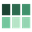 | Forest mini-preview |
|  | Sunset mini-preview |
|  | Berry mini-preview |
|  | Greyscale mini-preview |
|  | Financial mini-preview |
|  | Vivid mini-preview |

## Related References

- [Chart layouts and examples](docs/CHARTS.md)
- [PowerPoint UI reference](docs/POWERPOINT_UI_REFERENCE.md)
- [Google Slides companion](google-slides/README.md)
