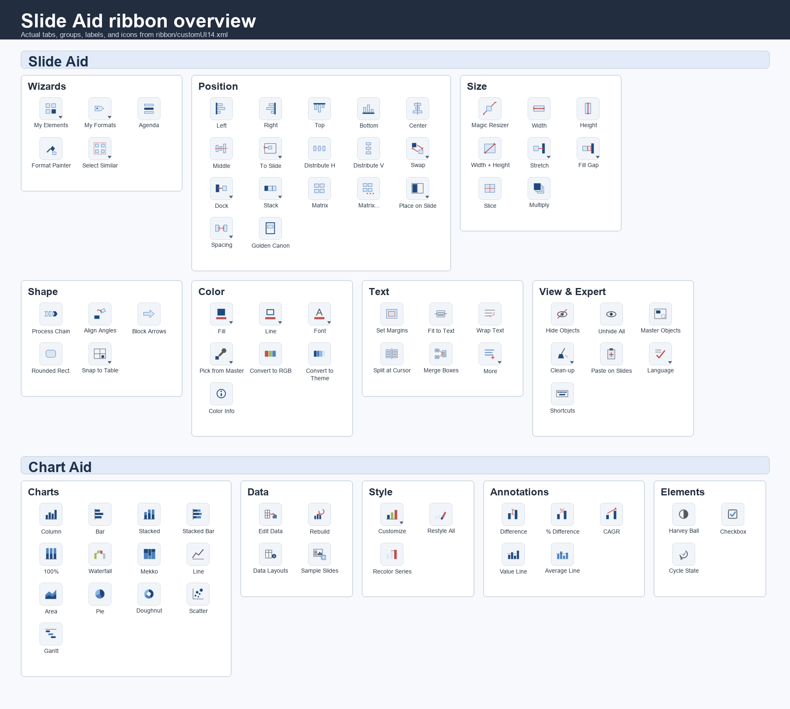

# Slide Aid — PowerPoint productivity tools for Mac

A VBA add-in with two ribbon tabs: **Slide Aid** (Master-based productivity tools; the **Master** is always the object you selected **last**, single object -> slide) and **Chart Aid** (table-driven charts drawn from shapes).



## Documentation

Start with the visual guide:

- [Slide Aid Documentation](DOCUMENTATION.md) - visual workflow demos, ribbon tour, and icon-by-icon reference.
- [Chart layouts and examples](docs/CHARTS.md) - table formats for every Chart Aid chart type.
- [PowerPoint UI reference](docs/POWERPOINT_UI_REFERENCE.md) - source-of-truth tab order, groups, control names, icon files, ribbon tags, and behavior.
- [Google Slides companion](apps/google-slides/README.md) - platform-specific notes for the separate Apps Script implementation.

## What It Does

- **Slide Aid** handles everyday production work: align, size, dock, distribute, stack, grid, recolor, format-paint, clean up, reuse components, and manage text boxes.
- **Chart Aid** builds editable shape-based charts from PowerPoint tables: column, bar, stacked, 100%, waterfall, Mekko, line, area, pie, doughnut, scatter, bubble, and Gantt. Style them with native panels — **Chart Settings** (sliders, toggles, colors) and **Edit Colors** — plus one-click color themes and per-series recolor.
- **Icons** is a visual task pane for original business, technology, finance, operations, people, security, communication, and ESG icons. The active schema-3 catalog is currently a reviewed consulting-style pilot set while the full catalog is being rebuilt. Search, filter, recolor, and click to insert; in PowerPoint an inserted icon becomes an editable vector via **Make Editable**, and in Google Slides it inserts as grouped vectors directly.
- **Reusable libraries** store personal elements and saved formats in PowerPoint's sandbox-safe Slide Aid folder.
- **Mac-native helpers** provide optional color picking and PowerPoint-scoped keyboard shortcuts through Hammerspoon.

## Core Model

Select the objects you want to change first, then select the reference object last. Slide Aid calls that last object the **Master**. With a single selected object, tools that need a reference use the slide itself.

All distance inputs are in **cm**, and dialogs remember your last-used values. My Elements / My Formats / preferences are stored in PowerPoint's sandbox container (`~/Library/Containers/com.microsoft.Powerpoint/Data/SlideAid/`) — the one location macro file I/O works without permission prompts.

Note on undo: PowerPoint VBA cannot group undo steps, so one chart build or restyle is many small undo entries. Rebuilding is safe (charts carry their data), but ⌘Z after a big operation takes several presses.

## Install (fresh, ~5 min) — the proven Mac flow

Hard-won facts this flow is built on: Mac PowerPoint only fires ribbon callbacks from loaded **add-ins** (documents render but don't fire); VBA `SaveAs` to .ppam is broken (UI Save As works); programmatic module import needs `defaults write com.microsoft.Powerpoint AccessVBOM -bool true` (once, PowerPoint closed).

1. Blank presentation → **Tools → Macro → Visual Basic Editor** → **File → Import File…** → `apps/powerpoint/tools/import_helper.bas`.
2. Click into `ImportAllModules` → **F5** → grant file access if asked → "23 modules imported". *(Run once only — it self-guards against double import.)*
3. **Debug → Compile VBAProject** — must be silent.
4. PowerPoint window: **File → Save As** → name `Slide Aid` → format **PowerPoint Macro-enabled Presentation (.pptm)** → into `apps/powerpoint/`. (Recent Mac builds don't offer .ppam in Save As; the injector converts.)
5. Terminal: `cd ~/repos/slide-aid/apps/powerpoint && python3 tools/inject_ribbon.py --make-ppam "Slide Aid.pptm" && mv -f "Slide Aid.ppam" "dist/Slide Aid.ppam"` — injects the ribbon and puts the release add-in in `dist/`.
6. **Tools → PowerPoint Add-ins → +** → select `apps/powerpoint/dist/Slide Aid.ppam` → tick → restart PowerPoint.
7. Test: two rectangles, select both, Slide Aid → Left.

## Updating after code changes

Three tiers, fastest first:

**Tier 1 — live testing, seconds (no rebuild).** Keep a dev `.pptm` open that contains all modules plus `import_helper.bas`, and let the stub add-in (`apps/powerpoint/tools/stub_addin.bas`) own the ribbon — clicks forward to the dev file via `Application.Run`. After editing `apps/powerpoint/src/*.bas` in your editor, run the **`RefreshModules`** macro in the dev file (Tools → Macro → Macros… → `RefreshModules`): it replaces all modules with the current `apps/powerpoint/src/` and you click the ribbon immediately. No .ppam, no restart.

**Tier 2 — rebuild the .ppam, one command.** From Terminal:

```bash
cd apps/powerpoint
./tools/build.sh        # builds dist/Slide Aid.ppam, offers to restart PowerPoint
./tools/build.sh -r     # same, restarts without asking
```

This stages `apps/powerpoint/src/*.bas` in PowerPoint's writable sandbox, then triggers the **`BuildSlideAid`** macro inside the running PowerPoint (hosted by the loaded add-in). The macro imports that sandbox-local source into a fresh presentation and runs the injector via the AppleScript helper. The resulting add-in is moved to `apps/powerpoint/dist/Slide Aid.ppam`. Bootstrap requirements, once: the helper recompiled after `buildPpam` was added (`osacompile` command below), and one manual rebuild so the loaded add-in contains `BuildSlideAid`. If AppleScript can't reach PowerPoint, run the macro by name from Tools → Macro → Macros… instead.

**Tier 3 — manual fallback.** Repeat install steps 1–6 with a fresh blank presentation (~3 min). If you edited code in the VBE instead of the files, run `ExportAllModules` first to write it back to `apps/powerpoint/src/`.

Only when `scripts/make_icons.py` or the ribbon icons changed, regenerate them **before** step 5 (the injector embeds whatever is in `shared/icons/`):

```bash
pip install pillow        # once
python3 scripts/make_icons.py
```

The generated PNGs live in `shared/icons/` and are part of the repo, so this step is normally not needed. If `apps/powerpoint/hammerspoon/slideaid.lua` changed, also re-copy it: `cp apps/powerpoint/hammerspoon/slideaid.lua ~/.hammerspoon/` (it reloads automatically on save).

When the icon source catalog changes, regenerate its shared manifest and compact PowerPoint data modules:

```bash
python3 scripts/build_icon_catalog.py
python3 scripts/build_icon_catalog.py --check
```

The icon artwork is original, MIT-licensed, and defined on a shared 24x24 primitive grid. PowerPoint uses the cross-platform Office.js task pane in `apps/powerpoint-iconaid/`; Google Slides uses the **Icons** sidebar tab. Both insert grouped native shapes rather than temporary preview slides or bitmap fallbacks.

For local PowerPoint development, serve the repository over trusted HTTPS on port 3000 and sideload `apps/powerpoint-iconaid/manifest.xml`. The manifest adds an **Insert Icons** button to PowerPoint's **Insert** tab (next to the VBA **Make Editable** button); the PPAM no longer contains the retired VBA icon picker.

For heavy iteration there is a live-editing setup: keep a dev .pptm open with all modules (edit → ⌘S → test) and let a thin stub add-in (`apps/powerpoint/tools/stub_addin.bas`) own the ribbon, forwarding clicks to the dev file via `Application.Run`. See comments in that file.

## Sharing with colleagues (installer)

To give the tool to other Mac users, build a self-contained installer zip **on your Mac** (after building the add-in):

```bash
cd apps/powerpoint
./tools/make_dist.sh          # -> dist/Slide Aid.zip
```

The zip contains the add-in, the **pre-compiled** SlideAidUI helper (the native color panel plus Chart Aid's Chart Settings and Edit Colors dialogs — recipients never run `osacompile`), the Hammerspoon shortcut config, and a double-clickable `install.command`. Recipients unzip, right-click `install.command` → Open, and answer one question (whether they want keyboard shortcuts via Hammerspoon — everything else is unconditional). The installer needs no admin rights: it copies the helper into PowerPoint's script folder, drops the .ppam into Office's own Add-Ins folder so it appears in the add-ins dialog automatically, and optionally sets up Hammerspoon (installing it via Homebrew when available, otherwise pointing to the download).

One step can't be automated (macOS sandboxing): the recipient must tick **Slide Aid** once in *Tools → PowerPoint Add-ins* and click *Enable Macros*. The installer prints this, and `INSTALL.md` inside the zip repeats it. `uninstall.command` reverses everything and asks before touching the user's palettes/element library. Re-running `make_dist.sh` + resharing the zip is also the update mechanism — the installer safely overwrites previous versions.

## Native dialogs helper (optional, recommended)

The `SlideAidUI` AppleScript helper gives Chart Aid its native macOS UI: the **Chart Settings** panel (sliders, checkboxes, popups for chart parameters), the **Edit Colors** palette editor, and the color panel behind **Recolor Series** (color wheel, sliders, swatches, eyedropper). One-time install:

```bash
mkdir -p ~/Library/Application\ Scripts/com.microsoft.Powerpoint
osacompile -o ~/Library/Application\ Scripts/com.microsoft.Powerpoint/SlideAidUI.scpt apps/powerpoint/tools/SlideAidUI.applescript
```

Without it, everything still works: Chart Settings and Edit Colors fall back to the on-slide table/swatch tools under **Style → More**, and color picking falls back to hex/R,G,B text entry. Recompile the helper whenever `SlideAidUI.applescript` changes. (Mechanism: ASObjC `NSAlert` panels and `choose color` via `AppleScriptTask` — the one sanctioned way for sandboxed VBA to show native dialogs.)

## Keyboard shortcuts (Hammerspoon)

Mac PowerPoint offers no in-process keyboard hooks, so shortcuts are implemented outside PowerPoint: [Hammerspoon](https://www.hammerspoon.org) captures your hotkeys system-wide and presses the Slide Aid ribbon buttons via the accessibility API.

```bash
brew install --cask hammerspoon
cp apps/powerpoint/hammerspoon/slideaid.lua ~/.hammerspoon/
echo 'require("slideaid")' >> ~/.hammerspoon/init.lua
```

Open Hammerspoon once, grant it Accessibility permission (System Settings → Privacy & Security → Accessibility), then Hammerspoon menu → **Reload Config**. You should see "Slide Aid shortcuts loaded".

Defaults: ⌃⌥L/R/T/B/C/M align to Master, ⌃⌥H/V distribute, ⌃⌥1/2/3 width/height/both, ⌃⌥X matrix, ⌃⌥G golden canon, ⌃⌥P format painter, ⌃⌥S swap, ⌃⌥K / ⌃⌥⇧K stack H/V. Edit the `BINDINGS` table at the top of `~/.hammerspoon/slideaid.lua` to change keys or add any tool — `button` is the ribbon label; add `item` for entries inside menus (e.g. Dock Left). Reload Config after edits.

Fallback note: `apps/powerpoint/src/modShortcuts.bas` keeps the native menu-bar approach for PowerPoint builds that expose it. Diagnosed on Mac PowerPoint (2026): `Application.CommandBars` contains only "Status Bar" and "Ribbon" — no menu bar, no context menus — so menu-bar shortcuts and right-click customization are structurally impossible there, not merely blocked.

## Files

```text
apps/powerpoint/src/          VBA modules for the canonical PowerPoint add-in
apps/powerpoint/ribbon/       RibbonX definition for Slide Aid and Chart Aid
apps/powerpoint/tools/        PowerPoint build, import, inject, install, and helper scripts
apps/powerpoint/hammerspoon/  PowerPoint-scoped keyboard shortcut config
apps/google-slides/           TypeScript/Apps Script companion for Google Slides
shared/icons/                 shared PNG button icons embedded by both builds
shared/iconaid/               generated icon catalog and icon-specific MIT license
shared/specs/                 shared product constants used to prevent parity drift
docs/                         user documentation, chart layouts, UI reference, and generated visuals
scripts/                      repo-level generators and validation scripts
ROADMAP.md                    future feature ideas
```

## Known Mac limitations

System-wide screen color picking and floating toolbars aren't possible in Mac VBA — use macOS **Digital Color Meter** and the Color ribbon menus. Several object-model members are missing on Mac (`DefaultLanguageID`, `Cell.Shape`, `TextRange.LanguageID`) — the sources late-bind around them; keep new code compiling via **Debug → Compile** on a Mac. The generic palette lives at the top of `apps/powerpoint/src/modColors.bas`.
