# Chart Aid — chart types, data formats, and examples

Every chart is built from a **PowerPoint table** you select (the "datasheet"). Select the table → click the chart button on the **Chart Aid** tab. The chart appears next to the table, remembers its data (→ *Edit Data* to change it), and is fully made of normal shapes.

> Tip: the **Sample Slides** ribbon button inserts these exact examples as live slides — table + chart, built inside PowerPoint by the actual chart code.

Each example below is chosen to show what the chart type is *for*, not just how to feed it. Images are rendered from the same geometry the add-in uses; in PowerPoint the colors follow your theme, a **Color Theme** from the ribbon gallery, or your own palette (*Style → Edit Colors*).

## Grid-data charts

Column, Bar, Stacked, Stacked Bar, 100%, Line, Area, and Mekko share one layout — **row 1 = category names** (top-left cell stays empty), **column 1 = series names**, body = numbers.

### Column — *compare a few series across periods*

Revenue by region (EUR m): Asia is the growth engine.

| | 2023 | 2024 | 2025 | 2026 |
|---|---|---|---|---|
| Europe | 42 | 48 | 55 | 61 |
| Americas | 35 | 39 | 46 | 58 |
| Asia | 18 | 26 | 37 | 52 |

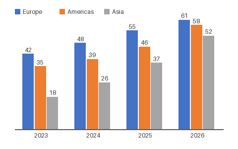

### Stacked Column — *total growth and its composition at once*

Revenue by product line: services drive the growth. Segment and total labels are automatic.

| | 2024 | 2025 | 2026 |
|---|---|---|---|
| Hardware | 50 | 48 | 45 |
| Software | 25 | 32 | 41 |
| Services | 12 | 20 | 31 |

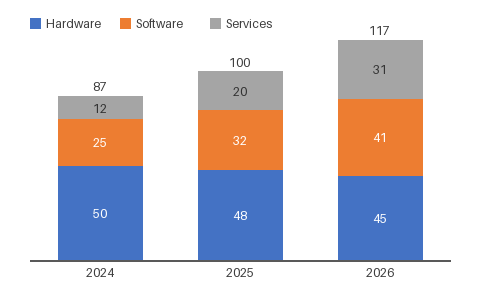

### 100% Column — *mix shifts over time*

Sales channel mix: online overtakes retail. Absolute totals are hidden on purpose — only the shift matters.

| | 2022 | 2024 | 2026 |
|---|---|---|---|
| Online | 20 | 38 | 57 |
| Retail | 65 | 48 | 31 |
| Partner | 15 | 14 | 12 |

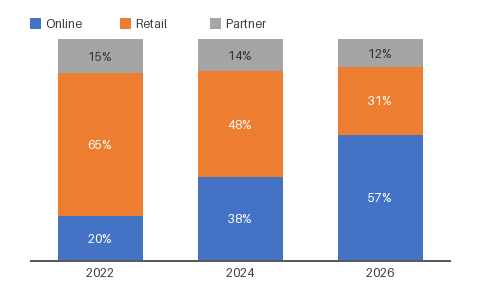

### Line — *trends over many periods*

Customer satisfaction (NPS): the line makes the overtake in Q1 '26 unmissable.

| | Q1 25 | Q2 25 | Q3 25 | Q4 25 | Q1 26 | Q2 26 |
|---|---|---|---|---|---|---|
| Us | 42 | 45 | 49 | 55 | 62 | 71 |
| Competitor | 58 | 57 | 55 | 54 | 52 | 51 |

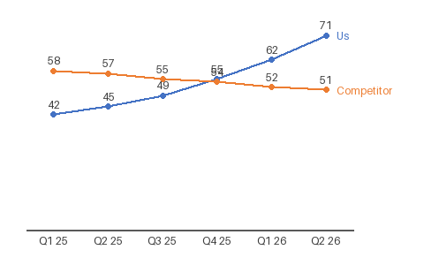

### Area — *cumulative volume and generational replacement*

Installed base by product generation: Gen 3 grows while Gen 1 phases out — and the total keeps rising.

| | 2022 | 2023 | 2024 | 2025 | 2026 |
|---|---|---|---|---|---|
| Gen 1 | 40 | 32 | 22 | 12 | 5 |
| Gen 2 | 8 | 25 | 38 | 42 | 40 |
| Gen 3 | 0 | 3 | 12 | 28 | 47 |

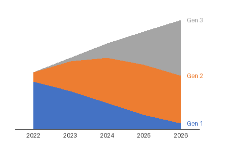

### Mekko — *two dimensions at once*

Market by region and segment (EUR m): column *width* = market size per region, segments = product mix within it. Totals appear above the columns.

| | Europe | Americas | Asia |
|---|---|---|---|
| Premium | 25 | 20 | 10 |
| Standard | 20 | 35 | 15 |
| Budget | 10 | 25 | 20 |

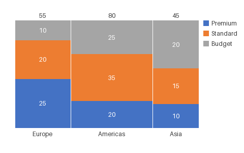

*Bar and Stacked Bar are the same charts rotated 90° — best for rankings (sort categories by value) and long category names.*

## Waterfall — *the P&L bridge*

Rows of **label | value**. A value of **`e`** or **`=`** creates a *computed subtotal* that always shows the running total — here Gross profit, EBITDA and EBIT are all computed automatically and stay correct when you edit the inputs.

| Revenue | 120 |
|---|---|
| COGS | -45 |
| Gross profit | = |
| Opex | -32 |
| EBITDA | = |
| D&A | -12 |
| EBIT | = |

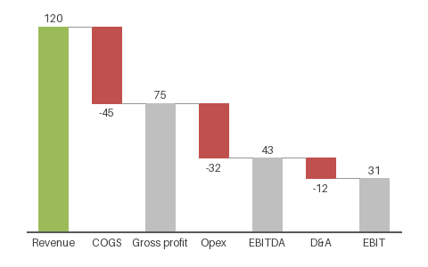

## Pie / Doughnut — *few slices, one message*

Rows of **label | value**. Pie: cost structure — half the cost is people. Doughnut: revenue mix, with room in the middle for a headline number.

| Personnel | 48 |
|---|---|
| Facilities | 21 |
| Marketing | 17 |
| Other | 14 |

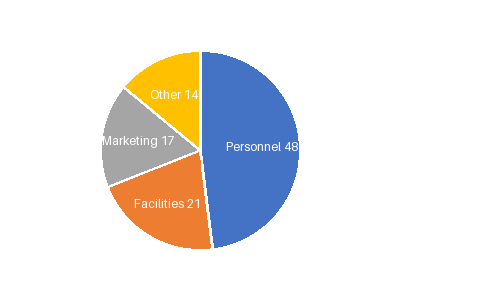
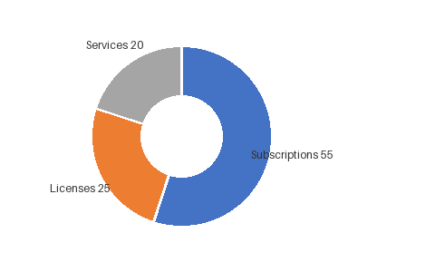

## Scatter / Bubble — *relationships and portfolios*

Rows of **label | x | y**, plus an optional **size** column for bubbles.

Scatter: price vs. satisfaction — the trend is clear and the outlier (overpriced, low satisfaction) jumps out. Bubble: the growth-share portfolio — x = market share %, y = market growth %, bubble size = revenue:

| Alpha | 32 | 4 | 120 |
|---|---|---|---|
| Bravo | 18 | 12 | 80 |
| Charlie | 9 | 22 | 40 |
| Delta | 4 | 28 | 15 |
| Echo | 25 | -2 | 95 |

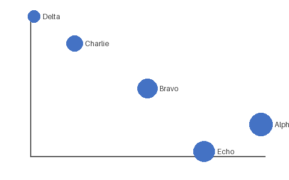

## Gantt — *plans with dependencies and milestones*

Rows of **activity | start | end**. Dates (`1.9.2026`) or plain numbers (weeks, sprints) both work; **start = end** produces a milestone diamond. Overlapping phases show hand-offs.

| Discovery | 1.9.2026 | 19.9.2026 |
|---|---|---|
| Design | 15.9.2026 | 10.10.2026 |
| Build | 6.10.2026 | 14.11.2026 |
| Testing | 9.11.2026 | 28.11.2026 |
| Launch | 1.12.2026 | 1.12.2026 |

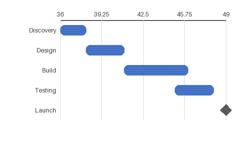

## After building

- **Edit Data**: select the chart → recreates its table → edit → select table + chart → click **Rebuild** (or any chart button) → rebuilt in place, table removed automatically.
- **Annotations**: click into the chart, select two bars → *Difference*, *% Difference*, or *CAGR* (values come from the data, not pixels). Select the chart → *Value Line*; select bars → *Average Line*.
- **Colors**: pick a **Color Theme** from the gallery, edit per-family palettes in *Style → Edit Colors*, or set waterfall/Gantt colors in *Style → Chart Settings*; *Recolor Series* recolors a whole series from one clicked bar (remembered across rebuilds).
- **Parameters**: select a chart → *Style → Chart Settings* for a native panel of that type's options (bar width, labels, decimals, legend, markers, colors). *Apply* rebuilds it in place and keeps the panel open; *OK* closes. With nothing selected the panel edits the defaults for new charts. *Restyle All* propagates palette/theme changes across the deck.
